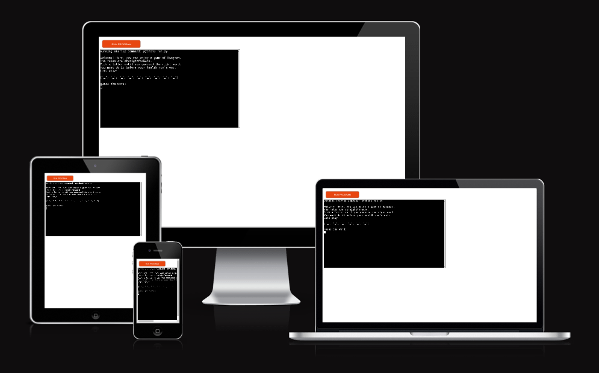
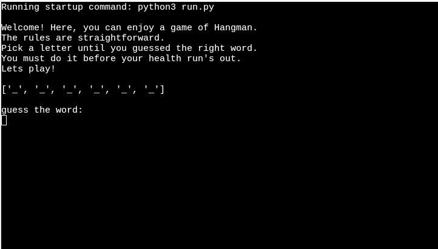
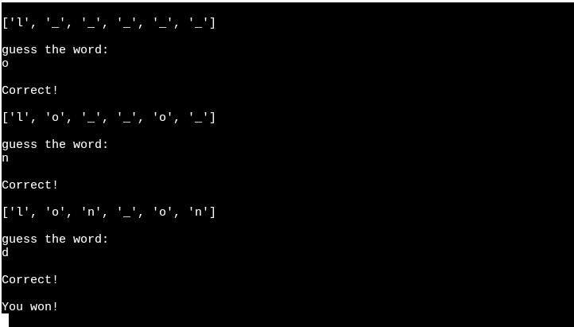
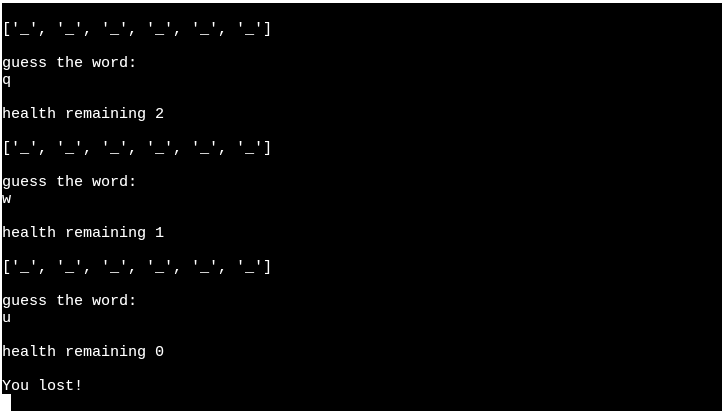

# Hangman

  

[Link to deployed site](https://hangman-463f08a11869.herokuapp.com/)

[View my Hangman-Game on Github Pages](https://github.com/Novak030/third-project)

### About the App

On this app you can play Hangman

## Existing Features

- __Welcome Screen__
  
  - When the app is loaded the rules are displayed.

- __Correct guess__

  - When you correctly guess a letter, a 'correct' message will be displayed, and the letter will be inserted into the underscore space.

- __Wrong guess / Health__
  
  - When you make an incorrect letter guess, the remaining health (turns) will be displayed.
  

- __Win / Loss__
 - When you win the game a "You Win!" message is displayed.
 - When you loose the game a "You lost" message is displayed.

## Features Left to Implement

- Game menu and a play again button
- Get questions from a Textfile, to input more words to guess.

## Bugs

- When the game is finished and you guessed the last letter, the letter is not displayed in the underscore space.

- When you guessed the word, it is not shown as an result.

## Deployment

This project was deployed through heroku:

Follow the step below:

- Create heroku app

- Add name for the app

- Choose either Europe or United States

- Set the buildbacks first to Python and afterward NodeJS

- Add The key is PORT and the value is 8000 to the Config Vars

- Connect to GitHub and then search for the project by the name

- Click Deploy
